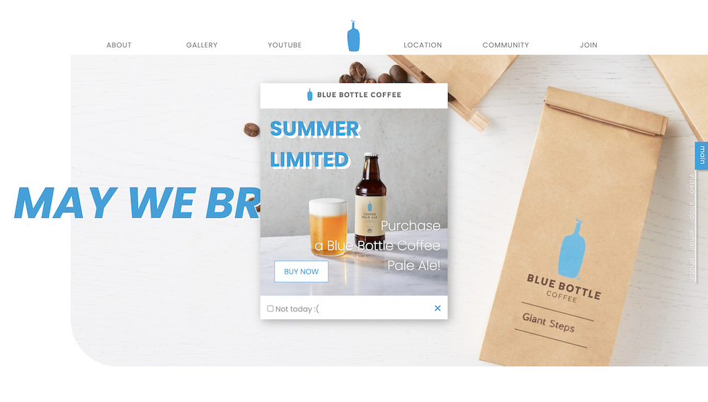

# HTML 기업형 웹사이트

HTML, SCSS, JavaScript로 제작한 개인 포트폴리오용 기업형 웹사이트입니다.

## Table of contents

- [Overview](#overview)
  - [Features](#features)
  - [Screenshot](#screenshot)
  - [Links](#links)
- [My process](#my-process)
  - [Built with](#built-with)
  - [What I learned](#what-i-learned)
  - [Reference](#reference)
- [Author](#author)

## Overview

### Features

- Main, About, Youtube, Gallery, Community, Location, Join 페이지로 구성된 기업형 웹사이트
- Web, Tablet, Mobile 크기별 반응형 웹사이트 구현
- Youtube API, Kakao map API, Flickr API 등 다양한 API 사용
- Cookie를 활용하여 팝업 생성

### Screenshot

### Links

- Live Site URL: [https://thisisyeji.github.io/bluebottle](https://thisisyeji.github.io/bluebottle)

## My process

### Built with

- Semantic HTML5 markup
- SCSS
- Flexbox
- JavaScript

### What I learned

- Youtube API, Kakao map API, Flickr API 사용법
- 쿠키에 날짜 정보를 넣어 하루동안 팝업 안 뜨게 설정
- offsetTop 값을 이용하여 세로 스크롤 이벤트

### Reference

- [Blue bottle coffee](https://bluebottlecoffee.com/)
- [Blue bottle coffee KOREA](https://www.bluebottlecoffeekorea.com/)
- [Blue bottle coffee JAPAN](https://store.bluebottlecoffee.jp/)

## Author

- Github - [김예지 Yeji Kim](https://github.com/thisisyeji)
